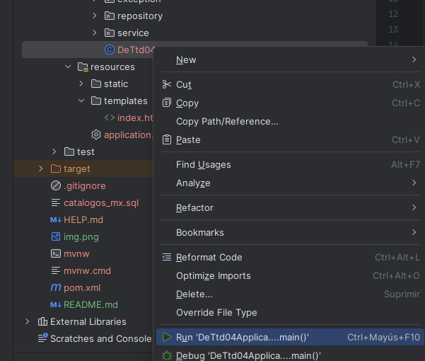

# DE-TT04

## Description

This project is a technical test for a Java developer. It involves a form for capturing addresses.

## Technologies Used

A REST API is created using Spring Boot Web, and Thymeleaf is used for the visual part of the application.

## How to Deploy Locally?

Within the project, there is a file named `catalogos_mx` which needs to be imported for database creation. Note: MySQL is used as the database.

It is necessary to modify the properties according to the local configuration of your system, whether it be `datasource.url`, `username`, or `password` for the database may differ in your environment.

The application server used by Spring Boot is an embedded Tomcat, so there is no configuration required. Simply right-click on the main class, run the project, and you are ready to test our application on port 8080.

